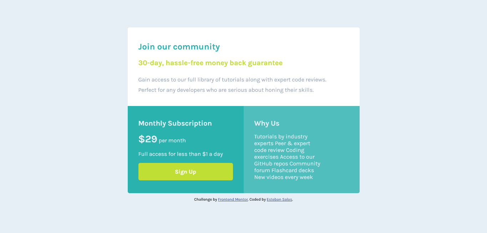

# Frontend Mentor - Single price grid component solution

This is a solution to the [Single price grid component challenge on Frontend Mentor](https://www.frontendmentor.io/challenges/single-price-grid-component-5ce41129d0ff452fec5abbbc). Frontend Mentor challenges help you improve your coding skills by building realistic projects.

## Table of contents

- [Overview](#overview)
  - [The challenge](#the-challenge)
  - [Screenshot](#screenshot)
  - [Links](#links)
- [My process](#my-process)
  - [Built with](#built-with)
  - [What I learned](#what-i-learned)
  - [Continued development](#continued-development)
- [Author](#author)

## Overview

### The challenge

Users should be able to:

- View the optimal layout for the component depending on their device's screen size
- See a hover state on desktop for the Sign Up call-to-action

### Screenshot




### Links

- Solution URL: [Add solution URL here](https://your-solution-url.com)
- Live Site URL: [Add live site URL here](https://your-live-site-url.com)

## My process

### Built with

- Semantic HTML5 markup
- CSS custom properties
- Flexbox
- CSS Grid
- Mobile-first workflow

**Note: These are just examples. Delete this note and replace the list above with your own choices**

### What I learned

I undertand more grid now and I feel great about it, I going to practice more with grid also the mobile-first workflow is really good and I'm going to use it from now on.

```html
<article class="cards card_up">
  <h1 class="title_card-up">Join our community</h1>
  <h3 class="subtitle_card-up">30-day, hassle-free money back guarantee</h3>
  <p>
    Gain access to our full library of tutorials along with expert code reviews.
  </p>
  <p>Perfect for any developers who are serious about honing their skills.</p>
</article>
```

```css
@media (min-width: 700px) {
  body {
    min-height: 100vh;
    display: flex;
    flex-direction: column;
    align-items: center;
    justify-content: center;
  }

  .container_card {
    display: grid;
    grid-template-columns: repeat(2, 1fr);
  }

  .card_up {
    grid-column-start: span 2;
  }

  .card_down-left {
    border-bottom-left-radius: 15px;
  }

  .card_down-right {
    border-bottom-left-radius: 0;
    border-bottom-right-radius: 15px;
  }
}
```

### Continued development

I'll practice grid with flexbox and responsive layout.


## Author

- Frontend Mentor - [@Geo0510](https://www.frontendmentor.io/profile/Geo0510)
